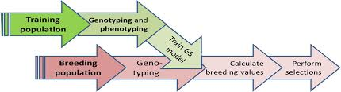

```{r setup, include=FALSE}
knitr::opts_chunk$set(echo = TRUE)
```

## Intro

Que es? Asociar datos de genotipos con datos de fenotípos para predecir valores de interes agronómico.



## Paquetes

Hay varios librerias, entre otros:

- rrBLUP
- sommer
- synbreed

## Limpieza de datos:

- excluir datos monomórficos
- excluir marcadores con datos faltantes mayor de 60%
- excluir marcadores con frecuencia de un menor alelo (maf) de < 5%
- excluir individuos con datos faltantes de más de 80%
- Imputación de datos con valor mediano


## Instalación

```{r eval=FALSE}
install.packages("synbreed")

install.packages("synbreedData")
```

## Cargar datos

- 10 chr 160cM
- 500 QTL segregantes con efectos bialelicos aditivos iguales
- DH lineas
- 1250 genotipos
- Un rasgo cuantitativo evaluado en 3 ambientes
- h2 = .46
- estructura: 25 familias biparentales

```{r}
library(synbreed)
library(synbreedData)

# datos simulados
data("maize")

summary(maize)
```

## Leer y guardar datos de VCF

```{r}
maize$info$map.unit <- "kb"
maize2 <- codeGeno(maize)
write.vcf(maize2, "maize.vcf")
geno <- read.vcf2matrix("maize.vcf")
```


## Ver datos crudos

```{r}
head(maize$pheno[,1,])
```

```{r}
maize$geno[10:13,20:25]
```


## Visualizar mapa genética

```{r}
plotGenMap(maize)
```

```{r}
 plotGenMap(maize, dense=TRUE,nMarker = FALSE, bw=1)
```

```{r}
summaryGenMap(maize)
```


## Filtrar datos

```{r}
maizeC <- codeGeno(maize, 
                   maf = 0.05,
                   nmiss = 0.1,
                   verbose = TRUE
                   )
```

## Estimate LD

- Chr1

```{r}
maizeLD01 <- pairwiseLD( maizeC, 
                         chr = 1,
                         type = "data.frame")
```


```{r}
par(mfrow = c(1, 2))
plot(maizeLD01)
plot(maizeLD01, type = "bars")
par(mfrow = c(1, 1))
```


## Estimate relación de parentesco

```{r}
U <- kin(maizeC, ret = "realized")

```

```{r}

plot(U)
```


## Predicción GBLUP

```{r}
GBLUP <- gpMod(maizeC, mod = "BLUP", kin = U/2)


```
```{r}
manhattanPlot(b = GBLUP, gpData = maizeC)
```

## Validación de modelo y estimación de capacidad predictiva

- validación cruzada 2


```{r}
cv <- crossVal(maizeC, 
               k = 2,
               Rep = 5,
               cov.matrix = list(U/2),
               varComp = GBLUP$fit$sigma,
               Seed = 1
)
               
```

```{r}
summary(cv)
```

## Ejemplo ratón

```{r}
data(mice)
plotGenMap(mice,dense=TRUE,nMarker = FALSE, bw=1)

```


