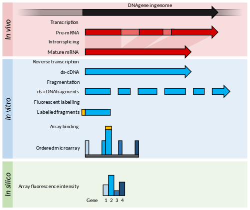

```{r setup, include=FALSE}
knitr::opts_chunk$set(echo = TRUE)
```

## Introducción


1. EST
2. SAGE/CAGE
3. Arrays
4. RNA seg


## EST


## SAGE/CAGE


## Arrays

1. Microarrays

2. Genearrays



## RNA seq


## Ejemplo

https://master.bioconductor.org/packages/release/workflows/vignettes/RNAseq123/inst/doc/limmaWorkflow.html

```{r}
library(limma)
library(Glimma)
library(edgeR)
library(Mus.musculus)
```

```{r message=FALSE, eval=FALSE}
url <- "https://www.ncbi.nlm.nih.gov/geo/download/?acc=GSE63310&format=file"
utils::download.file(url, destfile="GSE63310_RAW.tar", mode="wb") 
utils::untar("GSE63310_RAW.tar", exdir = ".")
files <- c("GSM1545535_10_6_5_11.txt", "GSM1545536_9_6_5_11.txt", "GSM1545538_purep53.txt",
  "GSM1545539_JMS8-2.txt", "GSM1545540_JMS8-3.txt", "GSM1545541_JMS8-4.txt",
  "GSM1545542_JMS8-5.txt", "GSM1545544_JMS9-P7c.txt", "GSM1545545_JMS9-P8c.txt")
for(i in paste(files, ".gz", sep=""))
  R.utils::gunzip(i, overwrite=TRUE)
```

```{r message=FALSE}
files <- c("GSM1545535_10_6_5_11.txt", "GSM1545536_9_6_5_11.txt", 
   "GSM1545538_purep53.txt", "GSM1545539_JMS8-2.txt", 
   "GSM1545540_JMS8-3.txt", "GSM1545541_JMS8-4.txt", 
   "GSM1545542_JMS8-5.txt", "GSM1545544_JMS9-P7c.txt", 
   "GSM1545545_JMS9-P8c.txt")
read.delim(files[1], nrow=5)
```

```{r message=FALSE}
x <- readDGE(files, columns=c(1,3))
class(x)
```

```{r message=FALSE}
dim(x)
```

```{r message=FALSE}
samplenames <- substring(colnames(x), 12, nchar(colnames(x)))
samplenames
```

```{r message=FALSE}
colnames(x) <- samplenames
group <- as.factor(c("LP", "ML", "Basal", "Basal", "ML", "LP", 
                     "Basal", "ML", "LP"))
x$samples$group <- group
lane <- as.factor(rep(c("L004","L006","L008"), c(3,4,2)))
x$samples$lane <- lane
x$samples
```

```{r message=FALSE}
geneid <- rownames(x)
genes <- select(Mus.musculus, keys=geneid, columns=c("SYMBOL", "TXCHROM"), 
                keytype="ENTREZID")
head(genes)
```

```{r message=FALSE}
genes <- genes[!duplicated(genes$ENTREZID),]
```


```{r message=FALSE}
x$genes <- genes
x
```

##

```{r message=FALSE}
cpm <- cpm(x)
lcpm <- cpm(x, log=TRUE, prior.count=2)
```


```{r message=FALSE}
table(rowSums(x$counts==0)==9)
```


```{r message=FALSE}
keep.exprs <- rowSums(cpm>1)>=3
x <- x[keep.exprs,, keep.lib.sizes=FALSE]
dim(x)
```


```{r message=FALSE}
library(RColorBrewer)
nsamples <- ncol(x)
col <- brewer.pal(nsamples, "Paired")
par(mfrow=c(1,2))
plot(density(lcpm[,1]), col=col[1], lwd=2, ylim=c(0,0.21), las=2, 
     main="", xlab="")
title(main="A. Raw data", xlab="Log-cpm")
abline(v=0, lty=3)
for (i in 2:nsamples){
 den <- density(lcpm[,i])
 lines(den$x, den$y, col=col[i], lwd=2)
}
legend("topright", samplenames, text.col=col, bty="n")
lcpm <- cpm(x, log=TRUE, prior.count=2)
plot(density(lcpm[,1]), col=col[1], lwd=2, ylim=c(0,0.21), las=2, 
     main="", xlab="")
title(main="B. Filtered data", xlab="Log-cpm")
abline(v=0, lty=3)
for (i in 2:nsamples){
   den <- density(lcpm[,i])
   lines(den$x, den$y, col=col[i], lwd=2)
}
legend("topright", samplenames, text.col=col, bty="n")
```

## Normalización

```{r message=FALSE}
x <- calcNormFactors(x, method = "TMM")
x$samples$norm.factors
```


```{r message=FALSE}
x2 <- x
x2$samples$norm.factors <- 1
x2$counts[,1] <- ceiling(x2$counts[,1]*0.05)
```


```{r message=FALSE}
par(mfrow=c(1,2))
lcpm <- cpm(x2, log=TRUE, prior.count=2)
boxplot(lcpm, las=2, col=col, main="")
title(main="A. Example: Unnormalised data",ylab="Log-cpm")
x2 <- calcNormFactors(x2)  
x2$samples$norm.factors
```


```{r}
lcpm <- cpm(x2, log=TRUE, prior.count=2)
boxplot(lcpm, las=2, col=col, main="")
title(main="B. Example: Normalised data",ylab="Log-cpm")

```


## Agrupamiento

```{r}
lcpm <- cpm(x, log=TRUE, prior.count=2)
par(mfrow=c(1,2))
col.group <- group
levels(col.group) <-  brewer.pal(nlevels(col.group), "Set1")
col.group <- as.character(col.group)
col.lane <- lane
levels(col.lane) <-  brewer.pal(nlevels(col.lane), "Set2")
col.lane <- as.character(col.lane)
plotMDS(lcpm, labels=group, col=col.group)
title(main="A. Sample groups")
plotMDS(lcpm, labels=lane, col=col.lane, dim=c(3,4))
title(main="B. Sequencing lanes")
```


```{r}
glMDSPlot(lcpm, labels=paste(group, lane, sep="_"), 
          groups=x$samples[,c(2,5)], launch=FALSE)
```


## Analisis de expresión diferencial

```{r}
design <- model.matrix(~0+group+lane)
colnames(design) <- gsub("group", "", colnames(design))
design
```

```{r}
contr.matrix <- makeContrasts(
   BasalvsLP = Basal-LP, 
   BasalvsML = Basal - ML, 
   LPvsML = LP - ML, 
   levels = colnames(design))
contr.matrix
```


